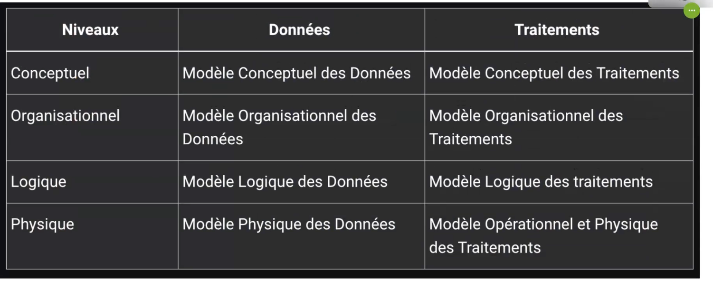
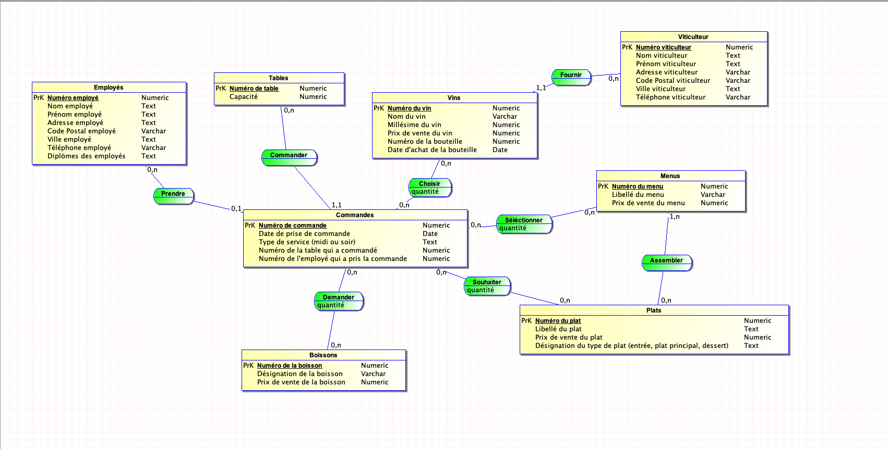

# Rappel de GIT

Rappel des commandes de base pour utiliser GIT :

- `git init` : Initialise un dépôt GIT.
- `git status` : Affiche l'état du dépôt (fichiers modifiés, non suivis).
- `git add .` : Ajoute tous les fichiers modifiés au prochain commit.
- `git commit -m "message"` : Enregistre les modifications dans l'historique avec un message.

---

# Méthode de modélisation de données : Merise

### Acronyme : 
**Méthode d'Étude et de Réalisation Informatique pour les Systèmes d'Entreprise**

### Approche nivelée (4 niveaux) :

1. **Le niveau conceptuel**
    - Résultat de la collecte d'informations sous forme de **Modèle Conceptuel des Données (MCD)**.

2. **Le niveau organisationnel**
    - Intègre les notions de temporalité, de chronologie des opérations, contraintes géographiques et niveau d'accès.

3. **Le niveau logique**
    - Transition entre le modèle conceptuel et la réalité technique. Prépare la transformation en base de données.

4. **Le niveau physique**
    - Organisation réelle des données dans le système (fichiers, bases de données, etc.).

---

# Les types d'informations

1. **Info élémentaire** : Doit être atomique, c'est-à-dire indivisible.
    - **Exemple** :
        - '34, rue de la paix, 75000 Paris'
        - On aurait pu découper en trois informations élémentaires :
          - 34 rue de la paix = **adresse**
          - 75000 = **code postal**
          - Paris = **ville**

    - Une valeur prise par une information élémentaire est appelée une **occurrence**.

2. **Info calculée** : Informations dérivées d'autres informations par le biais de calculs.

3. **Info traitement** : Processus qui peut être **automatique** ou **manuel**.

---

# Dictionnaire de données

Un dictionnaire de données est un document rassemblant les données classées par type :

- **Chaînes de caractères**, format texte
- **Type alphanumérique**, format texte
- **Type numérique** (integer, float, etc.)
- **Type date** (date, datetime, timestamp)
- **Logique ou booléen** (true, false)

### Format d'un dictionnaire de données :

---

# Les dépendances fonctionnelles

Les dépendances fonctionnelles permettent de définir une relation de dépendance entre deux attributs d'une même table.

- **Dépendances fonctionnelles composées** : Similaire aux dépendances fonctionnelles, mais avec plusieurs attributs.
- **Dépendances fonctionnelles élémentaires** : Suit la même logique mais au niveau élémentaire.
- **Dépendances fonctionnelles directes** : Dépendance directe entre les attributs, pas de transitivité

---

# Entités

- Les **entités** sont un ensemble de propriétés décrivant un objet du Système d'Information (SI) représentées par un rectangle dans les schémas.
- L'**ID** d'une propriété est souligné et permet d'identifier de manière unique une entrée.

## Cardinalité

- Indique le nombre de fois qu'une occurrence d'une entité participe aux occurrences de la relation : minimum, maximum (n pour illimité)

## Relations

- **Porteuses** : Contiennent des propriétés.
- **Binaire / Ternaire** : Type de relation en fonction du nombre d'entités impliquées.
- **Flexive** : Une entité est reliée à elle-même.

## Règles d'usage

- Toute entité doit avoir un identifiant unique.
- Toutes les propriétés d'une entité dépendent fonctionnellement de son identifiant.
- Le nom d'une propriété ne doit apparaitre qu'une seule fois dans tout le MCD.

## Identité

- **Forte** : Indépendante, n'a pas besoin d'une autre entité pour exister.
- **Faible** : Nécessite une association avec une autre entité pour être complète.

## Contraintes d'intégrité fonctionnelle (CIF)

- Une CIF est définie par le fait qu'une des entités de l'association est complètement déterminée par la connaissance d'une ou de plusieurs entités participant à l'association.

# TP
